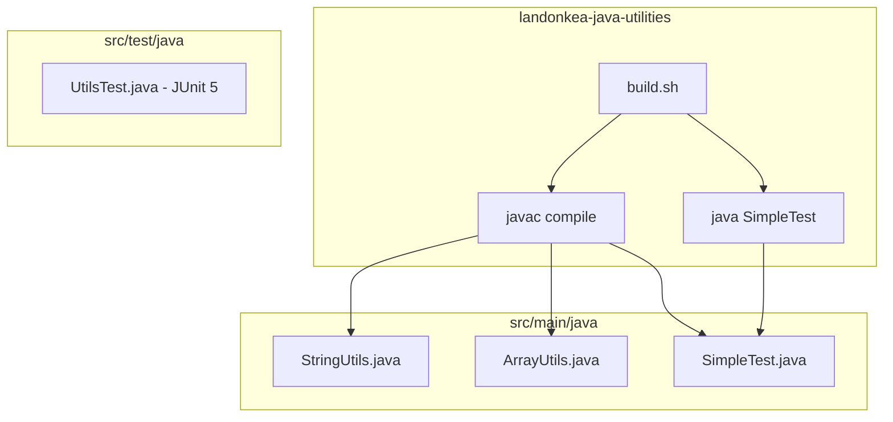
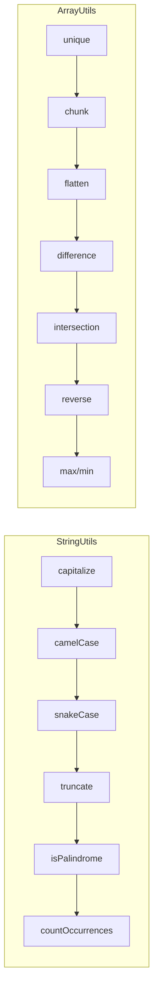
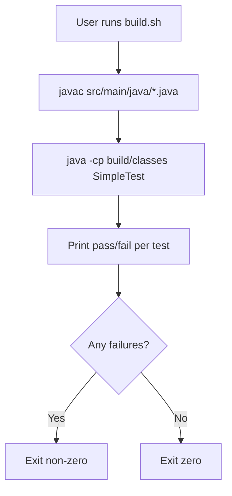

# landonkea-java-utilities — Design & Workflow

## High-Level Overview

## Class Structure

## Build Workflow

## File Relationships

| File | Purpose | Used By |
|------|---------|---------|
| `build.sh` | Compile + test | User |
| `src/main/java/StringUtils.java` | String helpers | Tests |
| `src/main/java/ArrayUtils.java` | Array helpers | Tests |
| `src/main/java/SimpleTest.java` | Test runner | `build.sh` |
| `src/test/java/UtilsTest.java` | JUnit 5 tests | IDE/CI |

## draw.io

[Open in draw.io](https://app.diagrams.net/#RJava%20utility%20library)
